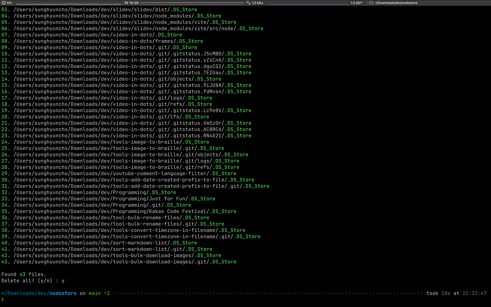

# No `.DS_Store`.py

Removes all `.DS_Store` and `._*` files in multiple folders & their subfolders. Use it at your own risk.

```python
python3 nodsstore.py multiple_folders_to_run_scripts
```

## Demo


